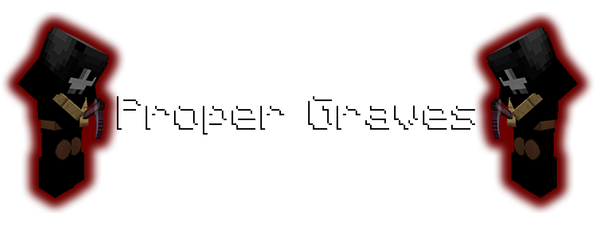

# Proper Graves

Proper Graves makes a grave appear at your death location, instead of dropping items.

## Features

- **Grave Creation**: A grave is created at your death location, storing all your items.
- **Inventory Preservation**: All items are preserved in the grave, preventing loss on death.
- **Grave Robbing Prevention**: Only the player who died can retrieve their items from the grave.
- **Fully Server-Side**: Proper Graves is fully server-side, meaning no client-side mods are required.

## Compatibility

This mod is compatible with Minecraft version 1.21.5 and requires Fabric Loader version 0.16.10 or higher.

## Installation

1. Download the mod from [Modrinth](https://modrinth.com/project/proper-graves).
2. Place the downloaded mod file into the `mods` folder of your Minecraft server.
3. Restart the server to apply the changes.

## Usage

When you die, a grave armor stand will appear at your death location. 
The grave will store all your items, which you can retrieve by interacting with it.

## Links

- [Modrinth Page](https://modrinth.com/project/proper-graves)
- [Report an Issue/Feature Request](https://github.com/GunnableScum/proper-graves/issues)
- [My Homepage](https://www.gunnablescum.live)
- [Support me on Ko-Fi!](https://ko-fi.com/gunnablescum)

## Contributing

Contributions are welcome! Please feel free to submit a Pull Request.

## License

This project is licensed under the MIT License. See the `LICENSE` file for details.